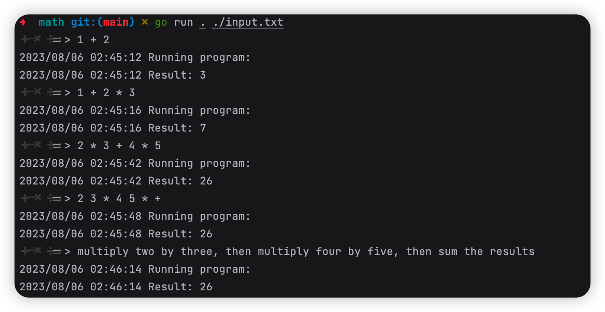

English | [简体中文](./README-zh_CN.md)

<a name="readme-top"></a>

<!-- PROJECT SHIELDS -->

[![go report card][go-report-card]][go-report-card-url]
[![Go.Dev reference][go.dev-reference]][go.dev-reference-url]
[![Go package][go-pacakge]][go-pacakge-url]
[![MIT License][license-shield]][license-url]
[![Contributors][contributors-shield]][contributors-url]
[![Forks][forks-shield]][forks-url]
[![Stargazers][stars-shield]][stars-url]
[![Issues][issues-shield]][issues-url]

# TypeChat-Go

This is the Go language implementation of [microsoft/TypeChat](https://github.com/microsoft/TypeChat).

TypeChat-Go is a library that makes it easy to build natural language interfaces using types.

> [microsoft/TypeChat](https://github.com/microsoft/TypeChat#typechat): Building natural language interfaces has traditionally
> been difficult. These apps often relied on complex decision trees to determine intent and collect the required inputs
> to
> take action. Large language models (LLMs) have made this easier by enabling us to take natural language input from a
> user and match to intent. This has introduced its own challenges including the need to constrain the model's reply for
> safety, structure responses from the model for further processing, and ensuring that the reply from the model is
> valid.
> Prompt engineering aims to solve these problems, but comes with a steep learning curve and increased fragility as the
> prompt increases in size.
> TypeChat replaces prompt engineering with schema engineering.
> Simply define types that represent the intents supported in your natural language application. That could be as simple
> as an interface for categorizing sentiment or more complex examples like types for a shopping cart or music
> application.
> For example, to add additional intents to a schema, a developer can add additional types into a discriminated union.
> To
> make schemas hierarchical, a developer can use a "meta-schema" to choose one or more sub-schemas based on user input.
>
> After defining your types, TypeChat takes care of the rest by:
> 1. Constructing a prompt to the LLM using types.
> 2. Validating the LLM response conforms to the schema. If the validation fails, repair the non-conforming output
     through further language model interaction.
> 3. Summarizing succinctly (without use of a LLM) the instance and confirm that it aligns with user intent.
>
> Types are all you need!

⭐️ Star to support our work!

# Getting Started

Install TypeChat-Go:

```bash 
go get github.com/maiqingqiang/typechat-go
```

Configure environment variables

Currently, the examples are running on OpenAI or Azure OpenAI endpoints.
To use an OpenAI endpoint, include the following environment variables:

| Variable              | Value                                                                                         |
|-----------------------|-----------------------------------------------------------------------------------------------|
| `OPENAI_MODEL`        | The OpenAI model name (e.g. `gpt-3.5-turbo` or `gpt-4`)                                       |
| `OPENAI_API_KEY`      | Your OpenAI API key                                                                           |
| `OPENAI_ENDPOINT`     | OpenAI API Endpoint - *optional*,  defaults to `"https://api.openai.com/v1/chat/completions"` |
| `OPENAI_ORGANIZATION` | OpenAI Organization - *optional*, defaults to `""`                                            |

To use an Azure OpenAI endpoint, include the following environment variables:

| Variable                | Value                                                                                                                                                                          |
|-------------------------|--------------------------------------------------------------------------------------------------------------------------------------------------------------------------------|
| `AZURE_OPENAI_ENDPOINT` | The full URL of the Azure OpenAI REST API (e.g. `https://YOUR_RESOURCE_NAME.openai.azure.com/openai/deployments/YOUR_DEPLOYMENT_NAME/chat/completions?api-version=2023-05-15`) |
| `AZURE_OPENAI_API_KEY`  | Your Azure OpenAI API key                                                                                                                                                      |

# Examples

To see TypeChat-Go in action, check out the [examples](./examples) found in this directory.

Each example shows how TypeChat-Go handles natural language input, and maps to validated JSON as output. Most example
inputs run on both GPT 3.5 and GPT 4.

| Name                                                                                     | Description                                                                                                                                                                                                                                                                                                                                                                                         |
|------------------------------------------------------------------------------------------|-----------------------------------------------------------------------------------------------------------------------------------------------------------------------------------------------------------------------------------------------------------------------------------------------------------------------------------------------------------------------------------------------------|
| [Sentiment](https://github.com/maiqingqiang/TypeChat-Go/tree/main/examples/sentiment)    | A sentiment classifier which categorizes user input as negative, neutral, or positive. This is TypeChat-Go's "hello world!"                                                                                                                                                                                                                                                                         |
| [Coffee Shop](https://github.com/maiqingqiang/TypeChat-Go/tree/main/examples/coffeeShop) | TODO                                                                                                                                                                                                                                                                                                                                                                                                |
| [Calendar](https://github.com/maiqingqiang/TypeChat-Go/tree/main/examples/calendar)      | An intelligent scheduler. This sample translates user intent into a sequence of actions to modify a calendar.                                                                                                                                                                                                                                                                                       |
| [Restaurant](https://github.com/maiqingqiang/TypeChat-Go/tree/main/examples/restaurant)  | An intelligent agent for taking orders at a restaurant. Similar to the coffee shop example, but uses a more complex schema to model more complex linguistic input. The prose files illustrate the line between simpler and more advanced language models in handling compound sentences, distractions, and corrections. This example also shows how we can use Go to provide a user intent summary. |
| [Math](https://github.com/maiqingqiang/TypeChat-Go/tree/main/examples/math)              | Translate calculations into simple programs given an API that can perform the 4 basic mathematical operators. This example highlights TypeChat-Go's program generation capabilities.                                                                                                                                                                                                                |
| [Music](https://github.com/maiqingqiang/TypeChat-Go/tree/main/examples/music)            | TODO                                                                                                                                                                                                                                                                                                                                                                                                |

## Run the examples

To run an example with one of these input files, run `go run . <input-file-path>`.
For example, in the [math](./examples/math) directory, you can run:

```
go run . /input.txt
```



<!-- MARKDOWN LINKS & IMAGES -->

[contributors-shield]: https://img.shields.io/github/contributors/maiqingqiang/TypeChat-Go.svg
[contributors-url]: https://github.com/maiqingqiang/TypeChat-Go/graphs/contributors
[forks-shield]: https://img.shields.io/github/forks/maiqingqiang/TypeChat-Go.svg
[forks-url]: https://github.com/maiqingqiang/TypeChat-Go/network/members
[stars-shield]: https://img.shields.io/github/stars/maiqingqiang/TypeChat-Go.svg
[stars-url]: https://github.com/maiqingqiang/TypeChat-Go/stargazers
[issues-shield]: https://img.shields.io/github/issues/maiqingqiang/TypeChat-Go.svg
[issues-url]: https://github.com/maiqingqiang/TypeChat-Go/issues
[license-shield]: https://img.shields.io/github/license/maiqingqiang/TypeChat-Go.svg
[license-url]: https://github.com/maiqingqiang/TypeChat-Go/blob/main/LICENSE
[go-report-card]: https://goreportcard.com/badge/github.com/maiqingqiang/typechat-go
[go-report-card-url]: https://goreportcard.com/report/github.com/maiqingqiang/typechat-go
[go.dev-reference]: https://img.shields.io/badge/go.dev-reference-blue?logo=go&logoColor=white
[go.dev-reference-url]: https://pkg.go.dev/github.com/maiqingqiang/typechat-go?tab=doc
[go-pacakge]: https://github.com/maiqingqiang/TypeChat-Go/actions/workflows/test.yml/badge.svg?branch=main
[go-pacakge-url]: https://github.com/maiqingqiang/TypeChat-Go/actions/workflows/test.yml